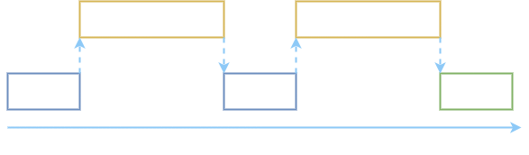
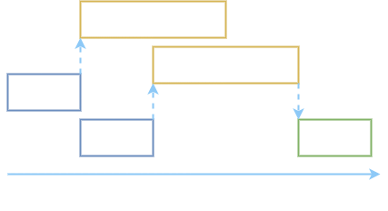

## Python threading

#### The below image represent how normal functions run in python.




#### The below image represent how functions run when using threads in python.





## Project structure

```
.
├── README.md                   # readme file
├── download_images.py          # using threading to download images
├── non-threading.png           # not using threading image
├── not_using_threading.py      # not using threading example
├── requirements.txt            # contains the required packages to download the images
├── threading.png               # using threading image
├── using_threading.py          # using threading example
└── using_threadpool.py         # using threadpool example
```
